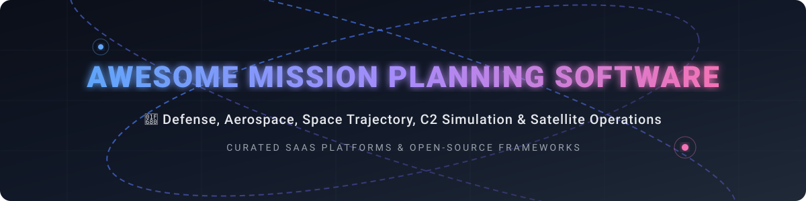

# 🚀 Awesome Mission Planning Software 🌌

  
  
  
  
  
  

## 📌 Top Mission Planning & Aerospace Software Ecosystem

**Curated List of SaaS Products & Open-Source GitHub Projects**

*Focused on Defense, Aerospace, Space Mission Design, Command and Control (C2) Planning, Trajectory Simulation & Operational Mission Management.*

---

## 💡 Overview & Industry Dynamics

> 📊 **Estimated Market Size & Structure**: The global **Mission Planning & Defense C2 Software** market is valued at approximately **$16.5 Billion** and is projected to expand to **$28.4 Billion by 2032** (CAGR ~7.1%). The space trajectory and orbital analytics software sub-segment adds an estimated **$2.4 Billion**. The sector is **moderately fragmented**—dominated by tier-1 defense contractors and aerospace leaders for high-tier operational command suites, while remaining highly competitive in niche satellite flight dynamics and commercial aviation electronic flight bag (EFB) markets.

---

## 🛠️ SaaS & Hosted Platforms

The table below lists top enterprise and SaaS platforms for multi-domain mission planning, flight dynamics, and tactical C2, sorted by company size / market valuation (descending).

| Platform / Product 🛰️ | Company Valuation / Revenue 💰 | Starting Pricing Tier 💳 | Free Tier / Trial Limits ⏳ | Core Focus & Features 🎯 |
| :--- | :--- | :--- | :--- | :--- |
| **[Palantir Mission Manager / Gotham](https://www.palantir.com/)** | ~$420.0 Billion Market Cap (~$4.5B Revenue) | $1,000,000 / year (Enterprise deployment floor) | No public free tier; 30-day proof-of-concept for qualified defense/enterprise clients | Operational command and control, multi-domain intelligence integration, and AI-driven mission management. |
| **[AGI STK / Ansys STK](https://www.ansys.com/)** | ~$32.9 Billion Valuation ($2.54B Revenue) | $12,000 / user / year (Base desktop license) | 14-day full STK Enterprise evaluation license upon request; free STK Basic version with restricted modules | Industry-standard physics simulation, orbital mechanics, sensor coverage, and space trajectory modeling. |
| **[ForeFlight Military](https://www.foreflight.com/)** (Boeing Subsidiary) | Boeing: ~$110.0 Billion Market Cap | $130 / year (Civilian Starter); Military MFB starting ~$260 / user / year | 30-day free trial on Apple App Store (includes Premium EFB features, excluding flight plan filing) | Military flight planning, electronic flight bag (EFB), aerial refueling routes, and tactical aviation charting. |
| **[BlackSky Spectra](https://www.blacksky.com/)** | ~$350.0 Million Market Cap (~$100M Revenue) | $550 / archived scene; $1,100 / new satellite capture | No free tier; demo access granted upon sales qualification | Real-time geospatial intelligence, automated AI satellite tasking, and high-revisit Earth observation analytics. |
| **[Systematic SitaWare](https://systematic.com/)** | Private (~$180 Million Annual Revenue) | $50,000 / year (Unit/command server baseline license) | No free tier or public trial; evaluation provided strictly via defense procurement channels | Standardized NATO C2 headquarters mission planning, situational awareness, and tactical data management. |
| **[AFSIM Cloud / Enterprise](https://www.afsim.com/)** | U.S. AFRL Government Platform ($0 Market Value) | $0 / year (Free for U.S. DoD & accredited partners) | Free full license for eligible U.S. DoD agencies and cleared defense contractors via Information Transfer Agreement (ITA) | Advanced operational simulation, wargaming, campaign-level assessment, and multi-domain threat modeling. |
| **[Orbit Logic](https://www.orbitlogic.com/)** | Private (~$25 Million Annual Revenue) | $15,000 / year (STK Desktop plugin or web API tier) | 30-day software evaluation key available for commercial and aerospace engineering teams | Specialized space system scheduling, satellite constellation tasking, and autonomous mission optimization. |
| **[Windward Mission Planner](https://www.windwardsoftware.com/)** | Private (~$15 Million Annual Revenue) | $2,400 / vessel / year | 14-day guided trial for maritime fleet operators | Maritime route planning, vessel operational scheduling, and maritime domain situational awareness. |

---

## 🔓 Open-Source GitHub Projects

Below are top open-source projects for space dynamics, orbital propagation, satellite tracking, and geospatial visualization. Items are sorted by GitHub Stars_Count (descending).

- **[CesiumGS/cesium](https://github.com/CesiumGS/cesium)**  🌐  
  3D geospatial platform for globe visualization, satellite orbit tracking, and real-time situational awareness.

- **[qgis/QGIS](https://github.com/qgis/QGIS)**  🗺️  
  Open-source Geographic Information System (GIS) used to construct custom tactical maps, terrain elevation layers, and mission planning views.

- **[holoviz/holoviews](https://github.com/holoviz/holoviews)**  📊  
  Python data visualization library widely used for mission data analysis, telemetry visualization, and trajectory plots.

- **[skyfielders/python-skyfield](https://github.com/skyfielders/python-skyfield)**  🌌  
  Elegant astronomy and orbital mechanics library for Python, computing positions for satellites, planets, and Earth-orbiting craft.

- **[poliastro/poliastro](https://github.com/poliastro/poliastro)**  🪐  
  Pure Python library for astrodynamics and orbital mechanics, focusing on interplanetary trajectory design and orbit transfers.

- **[JuliaSpace/SatelliteToolbox.jl](https://github.com/JuliaSpace/SatelliteToolbox.jl)**  🚀  
  Comprehensive Julia suit for satellite mission analysis, orbit propagation (SGP4/SDP4), atmosphere models, and coordinate transformations.

- **[nasa/GMAT](https://github.com/nasa/GMAT)**  🛸  
  NASA's General Mission Analysis Tool—leading open-source space trajectory optimization, orbit determination, and deep-space mission design engine.

- **[open-space-collective/open-space-toolkit-astrodynamics](https://github.com/open-space-collective/open-space-toolkit-astrodynamics)**  🛰️  
  High-performance C++ and Python astrodynamics library providing environment models, coordinate systems, and precision orbit propagation.

- **[Orekit (GitLab)](https://gitlab.orekit.org/orekit/orekit)** ⚙️  
  Low-level space dynamics library written in Java, serving as the foundational engine for space mission operations across space agencies worldwide.

---

## 🧠 Architectural Guidelines for Custom Mission Planning Systems

1. **Trajectory & Orbit Determination**: Use **NASA GMAT** or **Orekit** as the underlying physics propagation engine.
2. **Access & Coverage Analysis**: Compute satellite line-of-sight and sensor ground tracks with **Open Space Toolkit** or **poliastro**.
3. **Geospatial & Tactical Rendering**: Render 3D terrain, orbital tracks, and air corridors using **Cesium** and **QGIS**.
4. **Operational Integration**: Export planned mission routes and waypoint schedules into defense C2 formats or commercial flight plan systems.

---

## 🤝 How to Contribute

We welcome community contributions! To add or update software entries:
1. Fork the repository.
2. Add your entry to `README.md` keeping formatting consistent with existing tables and lists.
3. Submit a Pull Request detailing the software product, pricing, and open-source licensing.

---

## 💖 Support & Community

Thank you for exploring and supporting **Awesome Mission Planning Software**! If you find this curated directory useful for your aerospace engineering, satellite research, or defense technology projects, please consider:

- ⭐ **Starring** this repository on GitHub
- 🔀 **Forking** the repo to add new tools
- 📢 **Sharing** this repository with colleagues and aerospace communities

☕ **Sponsor & Buy Me a Coffee**:  
You can support the ongoing maintenance of this awesome list via the [GitHub Sponsor Dashboard](https://github.com/sponsors/ishandutta2007).

---

## 📈 Star History

---

## ⚠️ Disclaimer

*This is a community-curated collection intended for educational, research, and non-operational analysis purposes. Military mission planning and command-and-control operations are subject to export regulations (ITAR/EAR) and government accreditation.*
